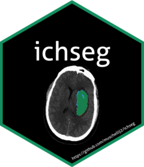

<!-- README.md is generated from README.Rmd. Please edit that file -->

```{r setup, include = FALSE}
knitr::opts_chunk$set(
  collapse = TRUE,
  comment = "",
  fig.path = "man/figures/README-"
)
```
# ichseg 

The goal of ichseg is to perform preprocessing on computed tomography (CT) scans, including skull stripping. Computes predictors of intracerebral hemorrhage (ICH) and uses these to predict a binary hemorrhage mask from the data.

## Citing

To cite `ichseg`, you can run:

```{r}
citation("ichseg")
```

## Installation

You can install `ichseg` from github with:

```{r gh-installation, eval = FALSE}
# install.packages("devtools")
devtools::install_github("muschellij2/ichseg")
```


## Requirements

These functions require a working installation of FSL (https://fsl.fmrib.ox.ac.uk/fsl/fslwiki/FslInstallation), which can be installed via Neurodebian as well: http://neuro.debian.net/pkgs/fsl-complete.html.  

## Prediction

In order to segment ICH from an image, use the `ich_segment` function:

```{r, eval = FALSE}
ichseg::ich_segment(img = "/path/to/ct/scan")
```

